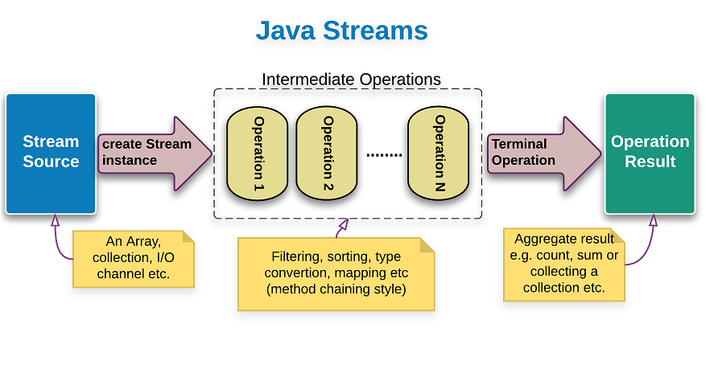
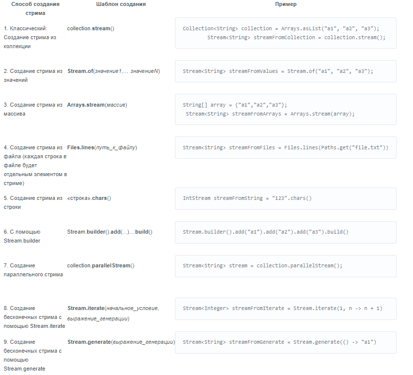

# STREAM

Java Stream API был создан для того, чтобы помочь пользователям ускорить и упростить обработку данных. Сам по себе API предоставляет инструмент, который позволяет нам дать рецепт того как обрабатывать объекты.

Конвеерные: Промежуточные операции следует воспринимать как «отложенные», т.е. они не меняют сами данные, а только задают правила их изменения.
Терминальные: как раз инициируют всю цепочку преобразований, закрывают поток и возвращают модифицированные данные

Важные моменты:
-Обработка не начнётся до тех пор, пока не будет вызван терминальный оператор
-Экземпляр, стрима нельзя использовать более одного раза
-Промежуточных операторов вызванных на одном стриме может быть множество, в то время терминальный оператор только один

**Конвеерные операторы**

filter(Predicate predicate) фильтрует стрим, пропуская только те элементы, что проходят по условию

map(Function mapper) даёт возможность создать функцию с помощью которой мы будем изменять каждый элемент и пропускать его дальше

limit(long maxSize) – ограничивает стрим по количеству элементов

skip(long n) – пропускаем n элементов

distinct() — проверяет стрим на уникальность элементов(убирает повторы элементов)

dropWhile(Predicate predicate) — пропускает элементы которые удовлетворяют условию

**Терминальные операторы:**

forEach(Consumer action) – аналог выполняет некоторое действие над объектом при этом ничего не возвращая;

count() – возвращает количество елементов стрима:

collect(Collector collector) – метод собирает все элементы в список, множество или другую коллекцию, сгруппировывает элементы по какому-нибудь критерию, объединяет всё в строку и т.д.

reduce(T identity, BinaryOperator accumulator) — преобразовывает все элементы стрима в один объект(посчитать сумму всех элементов, либо найти минимальный элемент), cперва берётся объект identity и первый элемент стрима, применяется функция accumulator и identity становится её результатом. Затем всё продолжается для остальных элементов.

Optional min(Comparator comparator)/ Optional max(Comparator comparator) - ищет минимальный/максимальный элемент, основываясь на переданном компараторе;

findFirst() – вытаскивает первый элемент стрима:

allMatch(Predicate predicate) — возвращает true, если все элементы стрима удовлетворяют условию. 

anyMatch(Predicate predicate) — вернет true, если хотя бы один элемент стрима удовлетворяет условию predicate

noneMatch(Predicate predicate) — вернёт true, если, пройдя все элементы стрима, ни один не удовлетворил условию predicate

# Способы создания стримов:

